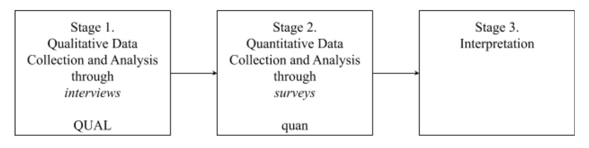

```{r setup, include=FALSE}
usethis::use_git_ignore(c("*.csv", "*.rds"))
options(htmltools.dir.version = FALSE)

#titleSlideClass: [inverse, center, middle]
#"default", "metropolis", "metropolis-fonts", 

# see options for customize slides: 
# https://slides.yihui.name/xaringan/
# https://slides.yihui.name/xaringan/incremental.html
# https://github.com/yihui/xaringan/wiki

library(knitr)
library(tidyverse)
library(xaringan)
```

class: inverse, center, middle

# Early-career Educators

---

# Transition & Induction

### From preparation to practice

```{r, out.width = "720px", echo = FALSE, fig.align = "center"}
include_graphics("img/teacher.jpg")
```

---

# Transition & Induction

### Tension between two worlds

```{r, out.width = "600px", echo = FALSE, fig.align = "center"}
include_graphics("img/two-worlds.jpg")
```

--

1. Educator preparation program

--

1. School of employment

---

# Transition & Induction

### Social media: From two worlds to many

```{r, out.width = "720px", echo = FALSE, fig.align = "center"}
include_graphics("img/many-worlds.jpg")
```

---

# Transition & Induction

### A universe

```{r, out.width = "720px", echo = FALSE, fig.align = "center"}
include_graphics("img/universe.jpg")
```

---

# Transition & Induction

### An edu-verse

```{r, out.width = "720px", echo = FALSE, fig.align = "center"}
include_graphics("img/edu-verse.jpg")
```

---

class: inverse, center, middle

# Purpose

---

# Purpose

### The purpose of this study is to explore:

--

* what supports for professional learning ECEs seek during induction, if any; 

--

* from whom; and 

--

* how, if at all, they use social media with the intention of seeking supports and connections.

```{r, out.width = "420px", echo = FALSE, fig.align = "center"}
include_graphics("img/purpose.jpg")
```

---

class: inverse, center, middle

# Framework

---

# Professional Learning Networks

```{r, out.width = "600x", echo = FALSE, fig.align = "center"}
include_graphics("img/network.jpg")
```

--

* Local to global

--

* Formal to informal

---

# Professional Learning Networks

```{r, out.width = "600px", echo = FALSE, fig.align = "center"}
include_graphics("img/network.jpg")
```

--

* Interpersonal connections

--

* Supports for professional learning

--

* Underlying reasons why

---

class: inverse, center, middle

# Review of Literature

---

# Teacher Induction

```{r, out.width = "600px", echo = FALSE, fig.align = "center"}
include_graphics("img/workshop.jpg")
```

--

1. Primarily formal induction programs

--

1. Induction challenges: everything new, still learning, identity development

--

1. Primarily local relationships

---

# Educators’ Use of Social Media

```{r, out.width = "600px", echo = FALSE, fig.align = "center"}
include_graphics("img/social-media.jpg")
```

--

1. Primarily informal learning opportunities

--

1. General difficulty of teaching: tiring, specific ideas, impress colleagues, isolation

--

1. Primarily global relationships

---

class: inverse, center, middle

# Purpose

---

# Purpose

### The purpose of this study is to explore:

--

* what supports for professional learning ECEs seek during induction, if any; 

--

* from whom; and 

--

* how, if at all, they use social media with the intention of seeking supports and connections.

```{r, out.width = "420px", echo = FALSE, fig.align = "center"}
include_graphics("img/purpose.jpg")
```

---

# Research Questions

```{r, out.width = "360", echo = FALSE, fig.align = "center"}
include_graphics("img/question.jpg")
```

--

* RQ1. What **supports for professional learning**, if any, are ECEs seeking during induction?

--

* RQ2. What **reasons**, if any, do ECEs report for seeking induction supports, and what reasons do they give, if any, for not seeking induction supports?

--

* RQ3. What **interpersonal connections** do ECEs make when seeking supports for professional learning during induction?

--

* RQ4. How, if at all, do ECEs use **social media** as a modality to access supports for professional learning during induction?

---

class: inverse, center, middle

# Method

---

# Overview of Methods

### Exploratory Sequential Mixed Methods

```{r, out.width = "720", echo = FALSE, fig.align = "center"}

```

--

* *Stage 1*: Qualitative interviews to explore

--

* *Stage 2*: Quantitative surveys to generalize

--

* *Stage 3*: Interpretation

---

# Stage 1: Qualitative Interviews

```{r, out.width = "480", echo = FALSE, fig.align = "center"}
include_graphics("img/interview.jpg")
```

--

* Participants: #MAET students, 0-3 years experience, in U.S.

--

* Pilot study: publicity email, interview protocol

--

* Data collection: semi-structured interviews to saturation

--

* Data analysis: transcribe, thematic analysis, eclectic coding, IRR

---

# Stage 2: Quantitative Surveys

```{r, out.width = "480", echo = FALSE, fig.align = "center"}
include_graphics("img/survey.jpg")
```

--

* Participants: far and wide, 0-3 years experience, in U.S.

--

* Pilot study: construct survey instrument, test internal reliability
--

* Data collection: ask colleagues to spread word, Twitter

--

* Data analysis: descriptive statistics

---

# Stage 3: Interpretation

```{r, out.width = "480", echo = FALSE, fig.align = "center"}
include_graphics("img/generalize.jpg")
```

--

* Not about comparing qualitative findings to quantitative

--

* Discussing which qualitative findings seem to be generalizable

---

class: inverse, center, middle

# Anticipated Findings

---

# Anticipated Findings

### RQ1. Induction Supports for Professional Learning

---

# Anticipated Findings

### RQ2. Reasons for Seeking Induction Supports and Reasons for Not Seeking Supports

---

# Anticipated Findings

### RQ3. Interpersonal Connections for Induction Supports

---

# Anticipated Findings

### RQ4. Use of Social Media as a Modality to Access Induction Supports

---

class: inverse, center, middle

# Significance

---

# Implications for Practice

---

# Implications for Research

---

class: inverse, center, middle

# Conclusion

---

# Conclusion

```{r, out.width = "600px", echo = FALSE, fig.align = "center"}
include_graphics("img/edu-verse.jpg")
```

I will explore:
* what supports for professional learning ECEs seek during induction, if any; 
* from whom; and 
* how, if at all, they use social media with the intention of seeking supports and connections.

---

class: inverse, center, middle

# Questions?

---

# My questions

--

* Pilot + IRB: order of work?

--

* Recruiting participants and achieving a suitable sample?

--

* Pitfalls to avoid / best practices for sustaining work in a dissertation?

